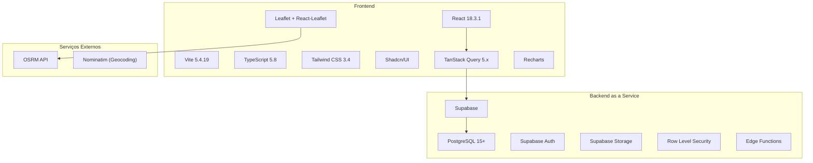
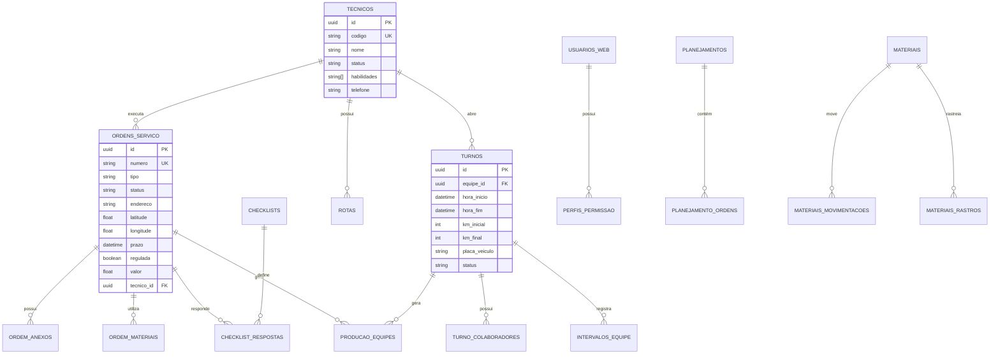
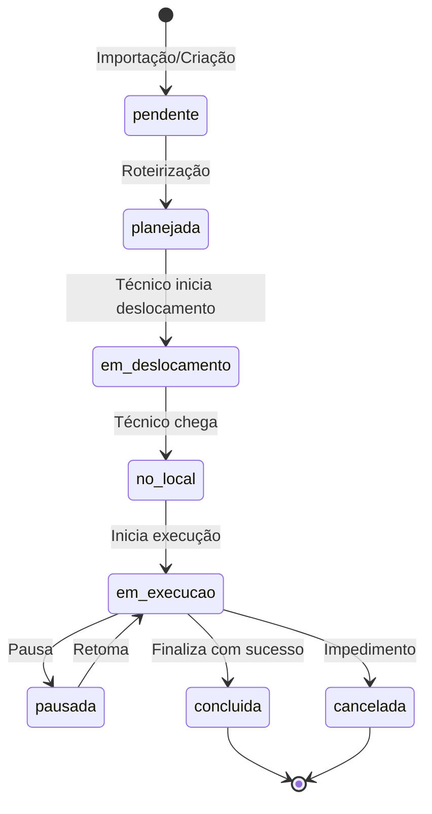
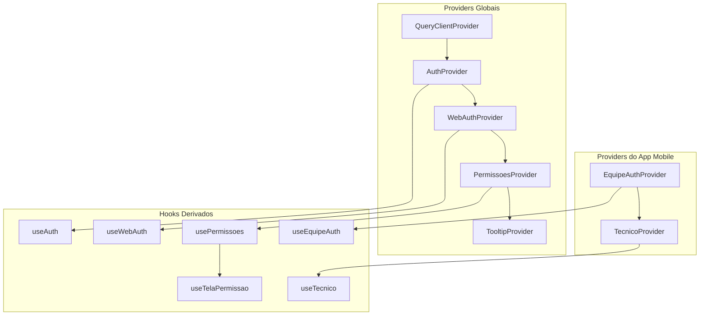

# 📘 SIRTEC Route System - Documentação Técnica Completa

> **Versão:** 1.0  
> **Data:** Dezembro 2025  
> **Autor:** Documentação gerada via auditoria de código

---

## 📑 Índice

1. [Visão Geral do Sistema](#1-visão-geral-do-sistema)
2. [Arquitetura do Sistema](#2-arquitetura-do-sistema)
3. [Módulos Funcionais](#3-módulos-funcionais)
4. [Regras de Negócio Críticas](#4-regras-de-negócio-críticas)
5. [Mapa de Dependências](#5-mapa-de-dependências)
6. [Guia de Manutenção](#6-guia-de-manutenção)

---

# 1. Visão Geral do Sistema

## 1.1 Propósito e Contexto de Negócio

O **SIRTEC Route System** é uma plataforma completa de **gestão de operações de campo** desenvolvida para empresas de serviços técnicos como concessionárias de energia elétrica, telecomunicações e saneamento.

### Problema que Resolve

| Desafio | Impacto sem o Sistema | Solução SIRTEC |
|---------|----------------------|----------------|
| Roteirização manual | Equipes percorrem rotas ineficientes, gastando combustível e tempo | Algoritmo de otimização com 20+ estratégias |
| Falta de visibilidade | Gestores não sabem onde estão as equipes | Torre de Controle em tempo real |
| Processos em papel | APRs e checklists perdidos, sem rastreabilidade | App mobile com formulários digitais |
| Controle de materiais | Materiais desviados ou sem controle | Módulo de estoque com rastreabilidade |
| Métricas inexistentes | Impossível medir produtividade | Dashboards com KPIs em tempo real |

### Proposta de Valor

```
┌─────────────────────────────────────────────────────────────────┐
│                    SIRTEC Route System                          │
├─────────────────────────────────────────────────────────────────┤
│  PLANEJAMENTO → EXECUÇÃO → ACOMPANHAMENTO → ANÁLISE            │
│                                                                 │
│  ┌──────────┐   ┌──────────┐   ┌──────────┐   ┌──────────┐    │
│  │Roteirizar│ → │Distribuir│ → │Monitorar │ → │Analisar  │    │
│  │   OSs    │   │ Equipes  │   │Tempo Real│   │  KPIs    │    │
│  └──────────┘   └──────────┘   └──────────┘   └──────────┘    │
└─────────────────────────────────────────────────────────────────┘
```

## 1.2 Público-Alvo

O sistema possui **duas interfaces distintas** para públicos diferentes:

### Painel Web (Gestão)
- **Coordenadores de Operação**: Planejam rotas e distribuem OSs
- **Torre de Controle**: Monitoram equipes em tempo real
- **Supervisores**: Acompanham métricas e produtividade
- **Administrativo**: Gerenciam cadastros, permissões e contratos

### App Mobile (Campo)
- **Técnicos/Eletricistas**: Executam as OSs em campo
- **Líderes de Equipe**: Abrem turno e gerenciam a equipe

## 1.3 Stack Tecnológico



### Dependências Principais (package.json)

| Categoria | Pacote | Versão | Finalidade |
|-----------|--------|--------|------------|
| **Core** | react | 18.3.1 | Framework UI |
| **Build** | vite | 5.4.19 | Bundler/Dev Server |
| **Tipagem** | typescript | 5.8.3 | Type Safety |
| **Estilo** | tailwindcss | 3.4.17 | CSS Utility-First |
| **Componentes** | @radix-ui/* | Vários | Primitivos UI acessíveis |
| **Estado** | @tanstack/react-query | 5.83.0 | Server State Management |
| **Backend** | @supabase/supabase-js | 2.87.1 | Cliente Supabase |
| **Mapas** | leaflet + react-leaflet | 1.9.4 / 4.2.1 | Renderização de mapas |
| **Gráficos** | recharts | 2.15.4 | Visualização de dados |
| **Formulários** | react-hook-form + zod | 7.61.1 / 3.25.76 | Validação de formulários |
| **Datas** | date-fns | 3.6.0 | Manipulação de datas |
| **PWA** | vite-plugin-pwa | 1.2.0 | Progressive Web App |
| **Excel** | xlsx | 0.18.5 | Importação/Exportação |
| **PDF** | jspdf + html2canvas | 3.0.4 / 1.4.1 | Geração de PDFs |

## 1.4 Diagrama de Alto Nível

```
┌─────────────────────────────────────────────────────────────────────────────┐
│                              SIRTEC Route System                             │
├─────────────────────────────────────────────────────────────────────────────┤
│                                                                              │
│  ┌─────────────────────────────┐     ┌─────────────────────────────┐        │
│  │      PAINEL WEB             │     │       APP MOBILE (PWA)      │        │
│  │  (Gestores/Coordenadores)   │     │    (Técnicos em Campo)      │        │
│  ├─────────────────────────────┤     ├─────────────────────────────┤        │
│  │ • Dashboard                 │     │ • Login por Equipe          │        │
│  │ • Roteirização              │     │ • Abertura de Turno         │        │
│  │ • Torre de Controle         │     │ • Lista de OSs              │        │
│  │ • Ordens de Serviço         │     │ • Execução de OS            │        │
│  │ • Gestão de Equipes         │     │ • APR/Checklists            │        │
│  │ • Materiais                 │     │ • Materiais                 │        │
│  │ • Administração             │     │ • Chat com Torre            │        │
│  │ • Relatórios                │     │ • Resultados do Dia         │        │
│  └──────────────┬──────────────┘     └──────────────┬──────────────┘        │
│                 │                                   │                        │
│                 └─────────────┬─────────────────────┘                        │
│                               │                                              │
│                               ▼                                              │
│  ┌─────────────────────────────────────────────────────────────────────┐    │
│  │                         SUPABASE (BaaS)                              │    │
│  ├─────────────────────────────────────────────────────────────────────┤    │
│  │  ┌─────────────┐  ┌─────────────┐  ┌─────────────┐  ┌────────────┐ │    │
│  │  │  PostgreSQL │  │    Auth     │  │   Storage   │  │  Realtime  │ │    │
│  │  │   (Dados)   │  │  (Usuários) │  │  (Arquivos) │  │ (Websocket)│ │    │
│  │  └─────────────┘  └─────────────┘  └─────────────┘  └────────────┘ │    │
│  └─────────────────────────────────────────────────────────────────────┘    │
│                               │                                              │
│                               ▼                                              │
│  ┌─────────────────────────────────────────────────────────────────────┐    │
│  │                    SERVIÇOS EXTERNOS                                 │    │
│  ├─────────────────────────────────────────────────────────────────────┤    │
│  │  ┌─────────────────────────┐     ┌─────────────────────────┐        │    │
│  │  │  OSRM (Rotas/Matriz)    │     │  Nominatim (Geocoding)  │        │    │
│  │  │  router.project-osrm.org│     │  nominatim.openstreetmap│        │    │
│  │  └─────────────────────────┘     └─────────────────────────┘        │    │
│  └─────────────────────────────────────────────────────────────────────┘    │
│                                                                              │
└─────────────────────────────────────────────────────────────────────────────┘
```

---

# 2. Arquitetura do Sistema

## 2.1 Arquitetura Frontend

O frontend segue uma arquitetura baseada em **componentes React** com separação clara de responsabilidades:

```
src/
├── App.tsx                    # Ponto de entrada, configuração de rotas
├── main.tsx                   # Bootstrap da aplicação
├── index.css                  # Estilos globais (Tailwind)
│
├── components/                # Componentes reutilizáveis
│   ├── ui/                    # Componentes Shadcn/UI (52 componentes)
│   ├── layout/                # Header, Sidebar, MainLayout
│   ├── auth/                  # ProtectedRoute, PermissionGuard
│   ├── dashboard/             # Cards, gráficos do dashboard
│   ├── torre/                 # Componentes da Torre de Controle
│   ├── ordens/                # Dialogs e forms de OS
│   ├── checklists/            # Componentes de checklists
│   ├── chat/                  # Sistema de chat
│   └── ...                    # Outros domínios
│
├── pages/                     # Páginas/Telas da aplicação
│   ├── app/                   # Telas do App Mobile (16 páginas)
│   ├── admin/                 # Módulo administrativo (10 páginas)
│   ├── cadastros/             # Telas de cadastro (9 páginas)
│   ├── materiais/             # Módulo de materiais (10 páginas)
│   └── *.tsx                  # Outras páginas principais
│
├── contexts/                  # Contextos React (Estado Global)
│   ├── AuthContext.tsx        # Autenticação Supabase (Web)
│   ├── WebAuthContext.tsx     # Autenticação customizada (Web)
│   ├── EquipeAuthContext.tsx  # Autenticação do App Mobile
│   ├── TecnicoContext.tsx     # Dados do técnico logado
│   └── ScrollRestoreContext.tsx # Restauração de scroll
│
├── hooks/                     # Hooks customizados
│   ├── usePermissoes.tsx      # Sistema de permissões
│   ├── useChat.ts             # Lógica do chat
│   ├── useLogSistema.ts       # Logs de auditoria
│   ├── useRetornoCampo.ts     # Retornos de campo
│   └── ...
│
├── lib/                       # Utilitários e lógica de negócio
│   ├── routingUtils.ts        # ⭐ ALGORITMO DE ROTEIRIZAÇÃO (4500+ linhas)
│   ├── authUtils.ts           # Funções de autenticação
│   ├── skillsUtils.ts         # Gestão de habilidades/skills
│   ├── geocodingUtils.ts      # Geocodificação
│   └── ...
│
├── services/                  # Serviços externos
│   └── osrm.ts                # Cliente OSRM (rotas)
│
├── integrations/              # Integrações
│   └── supabase/
│       ├── client.ts          # Cliente Supabase configurado
│       └── types.ts           # Tipos gerados do banco
│
└── types/                     # Tipos TypeScript
    └── territorios.ts         # Tipos de territórios/polígonos
```

## 2.2 Padrões Arquiteturais Utilizados

### 2.2.1 Context API para Estado Global

O sistema utiliza **5 contextos React** para gerenciar estado global:

```typescript
// Hierarquia de Providers (App.tsx)
<ErrorBoundary>
  <QueryClientProvider>           // React Query
    <AuthProvider>                // Auth Supabase
      <WebAuthProvider>           // Auth Web customizada
        <PermissoesProvider>      // Sistema de permissões
          <TooltipProvider>
            <BrowserRouter>
              {/* Rotas */}
            </BrowserRouter>
          </TooltipProvider>
        </PermissoesProvider>
      </WebAuthProvider>
    </AuthProvider>
  </QueryClientProvider>
</ErrorBoundary>
```

### 2.2.2 React Query para Server State

Todas as operações de dados usam **TanStack Query**:

```typescript
// Padrão de uso em todo o projeto
const { data, isLoading, error, refetch } = useQuery({
  queryKey: ["ordens-servico", filtros],
  queryFn: async () => {
    const { data, error } = await supabase
      .from("ordens_servico")
      .select("*")
      .eq("status", filtros.status);
    if (error) throw error;
    return data;
  },
  refetchInterval: 30000, // Atualização automática
});
```

### 2.2.3 Composição de Componentes

Os componentes seguem o padrão de **composição** do Shadcn/UI:

```typescript
// Exemplo: componentes compostos
<Card>
  <CardHeader>
    <CardTitle>Título</CardTitle>
    <CardDescription>Descrição</CardDescription>
  </CardHeader>
  <CardContent>
    {/* Conteúdo */}
  </CardContent>
</Card>
```

## 2.3 Arquitetura Backend (Supabase)

O backend é gerenciado pelo **Supabase** (Backend as a Service):

```
supabase/
├── config.toml                # Configuração do projeto
├── migrations/                # 32 migrations SQL
│   ├── 20250110000000_add_equipe_config_fields.sql
│   ├── 20250115000000_create_planejamento_system.sql
│   ├── 20251221170000_add_tecnicos_posicoes_tracking.sql
│   └── ...
└── functions/                 # Edge Functions
    └── send-recovery-email/   # Recuperação de senha
        └── index.ts
```

### Modelo de Dados Simplificado



### Tabelas Principais

| Tabela | Propósito | Registros Típicos |
|--------|-----------|-------------------|
| `ordens_servico` | Ordens de serviço | Milhares/mês |
| `tecnicos` | Equipes técnicas | Dezenas |
| `turnos` | Turnos de trabalho | Centenas/mês |
| `producao_equipes` | Produção executada | Milhares/mês |
| `planejamentos` | Planejamentos diários | Dezenas/mês |
| `planejamento_ordens` | OSs por planejamento | Milhares/mês |
| `checklist_respostas` | Respostas de checklists | Milhares/mês |
| `materiais` | Catálogo de materiais | Centenas |
| `materiais_movimentacoes` | Movimentações de estoque | Milhares/mês |
| `usuarios_web` | Usuários do painel | Dezenas |
| `perfis_permissao` | Perfis de acesso | Unidades |

## 2.4 Sistema de Autenticação

O sistema possui **dois fluxos de autenticação** distintos:

### 2.4.1 Autenticação Web (Painel)

```typescript
// WebAuthContext.tsx - Autenticação customizada
// Usa tabela usuarios_web com senha hash

const login = async (email: string, senha: string) => {
  // 1. Busca usuário na tabela usuarios_web
  const { data: usuario } = await supabase
    .from("usuarios_web")
    .select("*, perfis_permissao(*)")
    .eq("email", email)
    .single();
  
  // 2. Verifica senha (comparação de hash)
  // 3. Armazena sessão no localStorage
  // 4. Carrega permissões do perfil
};
```

### 2.4.2 Autenticação App (Mobile)

```typescript
// EquipeAuthContext.tsx - Login por código da equipe
// Não usa senha, apenas código da equipe + placa do veículo

const loginEquipe = async (codigoEquipe: string, placaVeiculo: string) => {
  // 1. Valida código da equipe
  // 2. Busca colaboradores vinculados
  // 3. Verifica turno existente
  // 4. Retorna colaboradores para seleção
};

const iniciarTurno = async (colaboradoresIds: string[], kmInicial: number) => {
  // 1. Cria registro na tabela turnos
  // 2. Vincula colaboradores ao turno
  // 3. Registra log de abertura
};
```

---

# 3. Módulos Funcionais

## 3.1 Módulo de Roteirização (Core)

**Localização:** `src/lib/routingUtils.ts` (~4.500 linhas)

Este é o **coração do sistema**, responsável por otimizar a distribuição de OSs entre equipes.

### Arquitetura do Algoritmo

```
┌─────────────────────────────────────────────────────────────────┐
│                    PIPELINE DE ROTEIRIZAÇÃO                     │
├─────────────────────────────────────────────────────────────────┤
│                                                                 │
│  1. PREPARAÇÃO                                                  │
│     ├── Carregar Skills (tipos de serviço)                     │
│     ├── Classificar OSs por prioridade                         │
│     ├── Carregar territórios (se habilitado)                   │
│     └── Calcular matriz de tempos (OSRM)                       │
│                                                                 │
│  2. PRIORIZAÇÃO                                                 │
│     ├── EMERGÊNCIAS (prazo vencido/hoje) → Prioridade MÁXIMA   │
│     ├── REGULADAS (flag regulada=true) → Prioridade ALTA       │
│     └── NORMAIS → Prioridade NORMAL                            │
│                                                                 │
│  3. ALOCAÇÃO                                                    │
│     ├── Por Território (se habilitado)                         │
│     │   └── Cada equipe só recebe OSs do seu território        │
│     └── Por Habilidade                                         │
│         └── Equipe deve ter skill para executar o tipo         │
│                                                                 │
│  4. OTIMIZAÇÃO (20+ estratégias)                               │
│     ├── Nearest Neighbor (tempo/distância)                     │
│     ├── Clusters geográficos                                   │
│     ├── Simulated Annealing                                    │
│     ├── Algoritmo Genético (20 indivíduos, 30 gerações)        │
│     ├── Lin-Kernighan heuristic                                │
│     ├── Nearest/Farthest insertion                             │
│     └── Híbrido combinando múltiplas estratégias               │
│                                                                 │
│  5. SELEÇÃO DO MELHOR                                          │
│     ├── Score prioriza DISTÂNCIA (peso 10x)                    │
│     ├── Aceita melhorias ≥ 0.1% distância                      │
│     └── Gera 3 opções: Financeiro, Quantidade, Distância       │
│                                                                 │
└─────────────────────────────────────────────────────────────────┘
```

### Função Principal

```typescript
export async function otimizarRotas(
  ordensServico: OrdemServico[],
  equipes: Equipe[],
  usarTerritorios: boolean = false,
  territoriosSelecionadosIds?: string[],
  estrategia?: 'financeiro' | 'quantidade' | 'distancia'
): Promise<ResultadoOtimizacao>
```

### Estrutura de Retorno

```typescript
interface ResultadoOtimizacao {
  rotas: RotaEquipe[];           // Rotas otimizadas por equipe
  naoAlocadas: NaoAlocada[];     // OSs que não puderam ser alocadas
  opcoes?: OpcaoRoteiro[];       // 3 opções de roteiro
}

interface RotaEquipe {
  equipe: Equipe;
  ordens: RotaServico[];         // OSs na ordem otimizada
  tempoTotal: number;            // Minutos
  distanciaTotal: number;        // Km
  faturamentoTotal: number;      // R$
}
```

### Páginas que Utilizam

- `Roteirizacao.tsx` - Tela principal de roteirização
- `Planejamentos.tsx` - Salvar planejamentos
- `AcompanhamentoRoteirizacoes.tsx` - Visualizar roteirizações salvas

## 3.2 Módulo de Ordens de Serviço

**Páginas:** `OrdensServico.tsx`, `AppOrdens.tsx`, `AppOrdemDetalhe.tsx`

### Ciclo de Vida da OS



### Status Possíveis

| Status | Descrição | Cor no Sistema |
|--------|-----------|----------------|
| `pendente` | Aguardando planejamento | Cinza |
| `planejada` | Incluída em roteirização | Azul |
| `em_deslocamento` | Técnico a caminho | Amarelo |
| `no_local` | Técnico chegou | Ciano |
| `em_execucao` | Em andamento | Laranja |
| `pausada` | Pausada temporariamente | Roxo |
| `concluida` | Finalizada com sucesso | Verde |
| `cancelada` | Cancelada/Impedimento | Vermelho |

### Campos Importantes

```typescript
interface OrdemServico {
  id: string;
  numero: string;              // Número único da OS
  tipo: string;                // Código do tipo (skill)
  status: string;              // Status atual
  endereco: string;            // Endereço completo
  latitude: number | null;     // Coordenadas GPS
  longitude: number | null;
  prazo: string | null;        // Prazo de execução
  regulada: boolean;           // Flag de OS regulada (ANEEL)
  valor: number | null;        // Valor em R$
  duracao_estimada: number;    // Minutos estimados
  tecnico_id: string | null;   // Equipe alocada
  cliente_nome: string | null;
  cliente_cpf: string | null;
  instalacao: string | null;   // Número da instalação
  medidor: string | null;      // Número do medidor
  observacoes: string | null;
  // Timestamps de execução
  deslocamento_iniciado_at: string | null;
  chegada_local_at: string | null;
  execucao_iniciada_at: string | null;
  pausado_at: string | null;
  concluido_at: string | null;
}
```

## 3.3 Módulo Torre de Controle

**Páginas:** `TorreControle.tsx`, `AcompanhamentoTempoReal.tsx`

### Funcionalidades

1. **Mapa em Tempo Real**
   - Posição das equipes (GPS)
   - Marcadores de OSs por status
   - Rotas planejadas vs executadas

2. **Timeline de Execução**
   - Visualização Gantt do dia
   - Previsão vs Realizado
   - Indicadores de atraso

3. **Alertas**
   - Equipes atrasadas
   - OSs com prazo vencendo
   - Equipes ociosas
   - Quebra de sequência

4. **Comunicação**
   - Chat integrado com equipes
   - Envio de mensagens de voz

### Componentes Chave

```
src/components/torre/
├── TimelinePrevistoRealizado.tsx  # Timeline Gantt
├── AlertasUrgentes.tsx            # Painel de alertas
├── PainelEquipesDestaque.tsx      # Cards de equipes
├── IntervencaoRota.tsx            # Modal de intervenção
└── TimelineEquipes.tsx            # Timeline simplificada
```

## 3.4 Módulo de Materiais

**Páginas:** `src/pages/materiais/` (10 páginas)

### Funcionalidades

| Página | Função |
|--------|--------|
| `MateriaisDashboard.tsx` | Visão geral do estoque |
| `CatalogoMateriais.tsx` | Cadastro de materiais |
| `EstoqueCentral.tsx` | Estoque do almoxarifado |
| `EntregasEquipes.tsx` | Entregas para equipes |
| `Recebimentos.tsx` | Entrada de materiais |
| `Devolucoes.tsx` | Devoluções de equipes |
| `Movimentacoes.tsx` | Histórico de movimentações |
| `AplicacoesOS.tsx` | Materiais aplicados em OSs |
| `Rastreabilidade.tsx` | Rastrear material específico |
| `RelatoriosMateriais.tsx` | Relatórios |

### Fluxo de Materiais

```
FORNECEDOR → RECEBIMENTO → ESTOQUE CENTRAL → ENTREGA → EQUIPE
                                    ↑                     ↓
                                    └── DEVOLUÇÃO ────────┘
                                                          ↓
                                                      APLICAÇÃO (OS)
```

## 3.5 Módulo de Checklists/APR

**Páginas:** `ChecklistsAvancado.tsx`, `AppAPR.tsx`

### Estrutura de um Checklist

```typescript
interface Checklist {
  id: string;
  nome: string;
  tipo: "apr" | "checklist" | "qualidade";
  tipo_servico: string;      // Skill vinculado
  obrigatorio: boolean;
  ativo: boolean;
  itens: GrupoPerguntas[];   // JSON com estrutura
}

interface GrupoPerguntas {
  id: string;
  titulo: string;
  perguntas: Pergunta[];
}

interface Pergunta {
  id: string;
  texto: string;
  tipo: "sim_nao" | "texto" | "numero" | "foto" | "assinatura" | "multipla_escolha";
  obrigatoria: boolean;
  config?: {
    condicional?: {
      pergunta_id: string;
      valor: string;
      torna_obrigatoria?: boolean;
    };
  };
}
```

### Fluxo no App

1. Técnico abre a OS
2. Sistema identifica tipo de serviço
3. Carrega checklists vinculados ao tipo
4. APR deve ser preenchida ANTES de iniciar execução
5. Checklist pode ser preenchido durante/após
6. Respostas salvas em `checklist_respostas`

## 3.6 Módulo Administrativo

**Páginas:** `src/pages/admin/` (10 páginas)

### Funcionalidades

| Página | Função |
|--------|--------|
| `AdminUsuariosWeb.tsx` | Gerenciar usuários do painel |
| `AdminUsuariosApp.tsx` | Gerenciar equipes do app |
| `AdminColaboradores.tsx` | Cadastrar colaboradores |
| `AdminPermissoes.tsx` | Perfis de permissão |
| `AdminContratos.tsx` | Contratos ativos |
| `AdminCadastrosBase.tsx` | Tipos de serviço, retornos, unidades |
| `AdminProcedimentos.tsx` | Procedimentos técnicos |
| `AdminLogs.tsx` | Logs de auditoria |

### Sistema de Permissões

```typescript
// Estrutura de permissões por perfil
interface PermissoesJson {
  [telaId: string]: {
    consultar: boolean;
    editar: boolean;
  };
}

// Exemplo
{
  "dashboard": { "consultar": true, "editar": false },
  "roteirizacao": { "consultar": true, "editar": true },
  "admin_usuarios": { "consultar": false, "editar": false }
}
```

## 3.7 App Mobile (PWA)

**Páginas:** `src/pages/app/` (16 páginas)

### Fluxo Principal

```
┌─────────────┐     ┌─────────────┐     ┌─────────────┐
│   Login     │ --> │ Abrir Turno │ --> │    Home     │
│ (Equipe+    │     │ (Selecionar │     │ (Dashboard  │
│  Placa)     │     │ colaborad.) │     │  do dia)    │
└─────────────┘     └─────────────┘     └─────────────┘
                                              │
                    ┌─────────────────────────┼─────────────────────────┐
                    ▼                         ▼                         ▼
             ┌─────────────┐          ┌─────────────┐          ┌─────────────┐
             │   Ordens    │          │   Estoque   │          │ Procedim.   │
             │  (Lista OS) │          │  (Materiais)│          │ (Manuais)   │
             └──────┬──────┘          └─────────────┘          └─────────────┘
                    │
                    ▼
             ┌─────────────┐
             │  Detalhe OS │
             │ ┌─────────┐ │
             │ │   APR   │ │ (Obrigatório antes)
             │ └─────────┘ │
             │ ┌─────────┐ │
             │ │Materiais│ │ (Aplicar materiais)
             │ └─────────┘ │
             │ ┌─────────┐ │
             │ │Finalizar│ │ (Retorno de campo)
             │ └─────────┘ │
             └─────────────┘
```

### Características PWA

- **Instalável**: Pode ser instalado como app nativo
- **Offline**: Cache de dados essenciais
- **Push**: Notificações (futuro)
- **Responsivo**: Otimizado para mobile

---

# 4. Regras de Negócio Críticas

## 4.1 Algoritmo de Roteirização

### 4.1.1 Priorização de OSs

```typescript
// Ordem de prioridade (maior para menor)
1. EMERGÊNCIAS com prazo vencido/hoje
2. REGULADAS (flag regulada=true)
3. OSs com prazo próximo
4. OSs normais por valor (maior primeiro)
```

### 4.1.2 Restrições de Alocação

```typescript
// Uma OS só pode ser alocada para uma equipe se:
1. A equipe possui a SKILL necessária
   equipe.habilidades.includes(os.tipo)

2. Se territórios habilitados: OS está no território da equipe
   pontoNoPoligono([os.latitude, os.longitude], territorio.coordenadas)

3. A equipe tem capacidade (jornada disponível)
   tempoAcumulado + os.duracao_estimada <= jornada

4. A OS não está em status terminal
   os.status !== "concluida" && os.status !== "cancelada"
```

### 4.1.3 Estratégias de Otimização

| Estratégia | Peso | Descrição |
|------------|------|-----------|
| Financeiro | Alto | Maximiza valor total das OSs |
| Quantidade | Médio | Maximiza número de OSs |
| Distância | Alto (10x) | Minimiza deslocamento total |

## 4.2 Gestão de Turnos

### 4.2.1 Regras de Abertura

```typescript
// Validações para abrir turno
1. Equipe deve existir e estar ativa
2. Placa do veículo deve ser informada
3. Mínimo de colaboradores respeitado (min_colaboradores)
4. Não pode ter outro turno aberto no mesmo dia
5. KM inicial deve ser informado (opcional mas recomendado)
```

### 4.2.2 Regras de Fechamento

```typescript
// Validações para fechar turno
1. Não pode ter OS em andamento
   (status: em_deslocamento, no_local, em_execucao)
   
2. KM final deve ser maior que KM inicial
   km_final > km_inicial

3. Todas APRs obrigatórias devem estar respondidas
```

## 4.3 Fluxo de Execução de OS

### 4.3.1 Transições de Status Permitidas

```typescript
const transicoesPermitidas = {
  pendente: ["planejada"],
  planejada: ["em_deslocamento", "cancelada"],
  em_deslocamento: ["no_local", "cancelada"],
  no_local: ["em_execucao", "cancelada"],
  em_execucao: ["pausada", "concluida", "cancelada"],
  pausada: ["em_execucao", "cancelada"],
  concluida: [], // Final
  cancelada: [], // Final
};
```

### 4.3.2 Timestamps Automáticos

```typescript
// Ao mudar status, sistema registra timestamp
"em_deslocamento" → deslocamento_iniciado_at = now()
"no_local"        → chegada_local_at = now()
"em_execucao"     → execucao_iniciada_at = now()
"pausada"         → pausado_at = now()
"concluida"       → concluido_at = now()
```

## 4.4 Sistema de Permissões

### 4.4.1 Hierarquia

```
ADMIN (is_admin=true)
  └── Acesso total a todas as funcionalidades
  
PERFIS CUSTOMIZADOS
  └── Permissões definidas por tela (consultar/editar)
```

### 4.4.2 Verificação de Permissão

```typescript
// Hook useTelaPermissao
const { podeEditar, podeConsultar, apenasLeitura, semAcesso } = useTelaPermissao("roteirizacao");

// Uso em componentes
{podeEditar && <Button>Salvar</Button>}
{semAcesso && <Navigate to="/" />}
```

## 4.5 Cálculos de Produtividade

### 4.5.1 Taxa de Execução

```typescript
taxaExecucao = (osExecutadas / osPlanejadas) * 100
```

### 4.5.2 Assertividade

```typescript
assertividade = (osExecutadasComSucesso / totalOsExecutadas) * 100
// Sucesso = retorno_campo.tipo === "executado"
```

### 4.5.3 Tempo Ocioso

```typescript
tempoOcioso = tempoTurno - (tempoEmOS + tempoIntervalos + tempoDeslocamento)
percentualOcioso = (tempoOcioso / tempoTurno) * 100
```

---

# 5. Mapa de Dependências

## 5.1 Dependências Externas (NPM)

### Core

```json
{
  "react": "^18.3.1",
  "react-dom": "^18.3.1",
  "react-router-dom": "^6.30.1",
  "typescript": "^5.8.3"
}
```

### Estado e Data Fetching

```json
{
  "@tanstack/react-query": "^5.83.0",
  "@supabase/supabase-js": "^2.87.1"
}
```

### UI e Estilização

```json
{
  "tailwindcss": "^3.4.17",
  "@radix-ui/react-*": "Vários (52 componentes)",
  "lucide-react": "^0.462.0",
  "class-variance-authority": "^0.7.1",
  "clsx": "^2.1.1",
  "tailwind-merge": "^2.6.0"
}
```

### Mapas e Geolocalização

```json
{
  "leaflet": "^1.9.4",
  "react-leaflet": "^4.2.1",
  "@types/leaflet": "^1.9.21"
}
```

### Formulários e Validação

```json
{
  "react-hook-form": "^7.61.1",
  "zod": "^3.25.76",
  "@hookform/resolvers": "^3.10.0"
}
```

### Utilitários

```json
{
  "date-fns": "^3.6.0",
  "xlsx": "^0.18.5",
  "jspdf": "^3.0.4",
  "html2canvas": "^1.4.1",
  "recharts": "^2.15.4"
}
```

## 5.2 Integrações Externas

### Supabase (Backend)

```typescript
// src/integrations/supabase/client.ts
import { createClient } from "@supabase/supabase-js";

const supabaseUrl = "https://xxx.supabase.co";
const supabaseKey = "eyJxxx...";

export const supabase = createClient(supabaseUrl, supabaseKey);
```

**Serviços Utilizados:**
- **Database**: PostgreSQL para dados
- **Auth**: Autenticação (não usado diretamente, customizado)
- **Storage**: Armazenamento de arquivos (fotos, anexos)
- **Realtime**: Atualizações em tempo real (chat)

### OSRM (Rotas)

```typescript
// src/services/osrm.ts
const OSRM_BASE_URL = "https://router.project-osrm.org";

// Endpoints utilizados:
// /route/v1/driving/{coords}  - Cálculo de rota
// /table/v1/driving/{coords}  - Matriz de tempos
```

**Limitações:**
- Máximo 100 pontos por requisição
- URL máxima ~8000 caracteres
- API pública com rate limiting

### Nominatim (Geocoding)

```typescript
// src/lib/geocodingUtils.ts
// Converte endereço em coordenadas
// API pública do OpenStreetMap
```

## 5.3 Diagrama de Contextos React



## 5.4 Fluxo de Dados Entre Módulos

```
┌─────────────────────────────────────────────────────────────────────────────┐
│                         FLUXO DE DADOS PRINCIPAL                            │
└─────────────────────────────────────────────────────────────────────────────┘

IMPORTAÇÃO DE OSs
    │
    ▼
┌─────────────┐     ┌─────────────┐     ┌─────────────┐
│ OrdensServico│ --> │ Roteirização│ --> │ Planejamentos│
│  (CRUD)     │     │ (Algoritmo) │     │   (Salvar)  │
└─────────────┘     └─────────────┘     └─────────────┘
                           │
                           ▼
                    ┌─────────────┐
                    │   SUPABASE  │
                    │ planejamento│
                    │ _ordens     │
                    └──────┬──────┘
                           │
         ┌─────────────────┼─────────────────┐
         ▼                 ▼                 ▼
  ┌─────────────┐   ┌─────────────┐   ┌─────────────┐
  │  App Mobile │   │ Torre Ctrl  │   │  Dashboard  │
  │ (Execução)  │   │(Acompanham.)│   │  (Métricas) │
  └──────┬──────┘   └─────────────┘   └─────────────┘
         │
         ▼
  ┌─────────────┐
  │ producao_   │
  │ equipes     │
  └─────────────┘

```

---

# 6. Guia de Manutenção

## 6.1 Setup do Ambiente de Desenvolvimento

### Pré-requisitos

- Node.js 18+ (recomendado 20 LTS)
- npm ou bun
- Git
- VS Code (recomendado)

### Instalação

```bash
# 1. Clonar repositório
git clone <url-do-repositorio>
cd pixel-perfect-replication

# 2. Instalar dependências
npm install
# ou
bun install

# 3. Configurar variáveis de ambiente
# Criar arquivo .env.local (se necessário)
VITE_SUPABASE_URL=https://xxx.supabase.co
VITE_SUPABASE_ANON_KEY=eyJxxx...

# 4. Iniciar servidor de desenvolvimento
npm run dev
```

### Scripts Disponíveis

```json
{
  "dev": "vite",                    // Desenvolvimento
  "build": "vite build",            // Build produção
  "build:dev": "vite build --mode development",
  "preview": "vite preview",        // Preview do build
  "lint": "eslint ."                // Verificar código
}
```

## 6.2 Convenções de Código

### Estrutura de Arquivos

```typescript
// Página típica
import { useState, useEffect } from "react";           // 1. React
import { useQuery } from "@tanstack/react-query";      // 2. Libs externas
import { supabase } from "@/integrations/supabase";    // 3. Integrações
import { Button } from "@/components/ui/button";       // 4. Componentes UI
import { usePermissoes } from "@/hooks/usePermissoes"; // 5. Hooks
import { formatDate } from "@/lib/utils";              // 6. Utilitários

// Interfaces
interface Props { ... }

// Componente
export default function NomeDaPagina() {
  // 1. Hooks
  // 2. Estados
  // 3. Queries
  // 4. Handlers
  // 5. Render
}
```

### Nomenclatura

| Tipo | Convenção | Exemplo |
|------|-----------|---------|
| Componentes | PascalCase | `OrdemServicoCard` |
| Hooks | camelCase com "use" | `usePermissoes` |
| Utilitários | camelCase | `formatCurrency` |
| Constantes | UPPER_SNAKE | `MAX_UPLOAD_SIZE` |
| Arquivos TSX | PascalCase | `Dashboard.tsx` |
| Arquivos TS | camelCase | `authUtils.ts` |

### Padrões de Query

```typescript
// Sempre use queryKey descritivo
const { data } = useQuery({
  queryKey: ["entidade", "acao", parametros],
  queryFn: async () => { ... },
  staleTime: 5 * 60 * 1000,      // 5 minutos
  refetchInterval: false,         // ou número em ms
});

// Exemplo
queryKey: ["ordens-servico", "lista", { status, data, equipeId }]
```

## 6.3 Áreas de Risco (Atenção Redobrada)

### ⚠️ routingUtils.ts

**Risco: CRÍTICO**

Este arquivo contém o algoritmo de roteirização (~4.500 linhas). Alterações podem:
- Quebrar a distribuição de OSs
- Causar rotas ineficientes
- Afetar cálculos de tempo/distância

**Antes de alterar:**
1. Entenda completamente o fluxo existente
2. Teste com dados reais
3. Compare métricas antes/depois
4. Mantenha backup funcional

### ⚠️ Contextos de Autenticação

**Risco: ALTO**

Os arquivos `AuthContext.tsx`, `WebAuthContext.tsx` e `EquipeAuthContext.tsx` controlam todo o acesso ao sistema.

**Cuidados:**
- Não altere a lógica de localStorage
- Mantenha compatibilidade de sessão
- Teste logout/login em múltiplas abas

### ⚠️ Migrations SQL

**Risco: ALTO**

Migrations em `supabase/migrations/` são imutáveis após deploy.

**Regras:**
- NUNCA edite uma migration já aplicada
- Sempre crie nova migration para alterações
- Teste em ambiente de desenvolvimento primeiro
- Faça backup antes de aplicar em produção

### ⚠️ Tipos Supabase

**Risco: MÉDIO**

O arquivo `src/integrations/supabase/types.ts` é gerado automaticamente.

**Cuidado:**
- Não edite manualmente
- Regenere após alterações no banco:
  ```bash
  npx supabase gen types typescript --project-id xxx > src/integrations/supabase/types.ts
  ```

## 6.4 Como Adicionar Novas Funcionalidades

### Nova Página

```bash
# 1. Criar arquivo em src/pages/
src/pages/NovaPagina.tsx

# 2. Adicionar rota em App.tsx
<Route path="/nova-pagina" element={<ProtectedRoute><NovaPagina /></ProtectedRoute>} />

# 3. Adicionar no menu (se necessário)
src/components/layout/Sidebar.tsx

# 4. Adicionar permissão (se necessário)
- Criar entrada no perfis_permissao.permissoes_json
- Usar useTelaPermissao("nova_pagina") no componente
```

### Novo Campo no Banco

```bash
# 1. Criar migration
supabase/migrations/YYYYMMDDHHMMSS_add_campo_tabela.sql

# 2. Regenerar tipos
npx supabase gen types typescript ...

# 3. Atualizar interfaces locais (se houver)

# 4. Atualizar queries que usam a tabela
```

### Novo Componente UI

```bash
# 1. Se for Shadcn, usar CLI
npx shadcn-ui@latest add nome-componente

# 2. Se for customizado
src/components/dominio/NomeComponente.tsx

# 3. Exportar se reutilizável
src/components/dominio/index.ts
```

## 6.5 Troubleshooting Comum

### Problema: "Permissão negada" mesmo sendo admin

**Causa:** Cache de permissões desatualizado

**Solução:**
```typescript
// Limpar localStorage e relogar
localStorage.removeItem("usuario_web_session");
window.location.reload();
```

### Problema: OSs não aparecem na roteirização

**Causas possíveis:**
1. Status não é "pendente" ou "planejada"
2. OS sem coordenadas (latitude/longitude null)
3. Tipo de OS não cadastrado em skills
4. Nenhuma equipe com skill compatível

**Debug:**
```typescript
// No console, verificar OSs filtradas
console.log(ordensServico.filter(os => 
  os.status === "pendente" && 
  os.latitude && 
  os.longitude
));
```

### Problema: Mapa não carrega

**Causas possíveis:**
1. Coordenadas inválidas
2. OSRM indisponível
3. Limite de requisições OSRM

**Solução:**
- Verificar console para erros de rede
- Sistema usa fallback para rota reta se OSRM falhar

### Problema: App mobile não sincroniza

**Causas possíveis:**
1. Sem conexão de internet
2. Turno não aberto
3. Equipe não autenticada

**Solução:**
```typescript
// Verificar estado no localStorage
console.log(localStorage.getItem("equipe_auth"));
console.log(localStorage.getItem("turno_auth"));
```

## 6.6 Scripts SQL de Manutenção

### Consultas Úteis

```sql
-- OSs sem coordenadas
SELECT numero, endereco 
FROM ordens_servico 
WHERE latitude IS NULL OR longitude IS NULL;

-- Turnos abertos há mais de 12h
SELECT t.*, e.codigo 
FROM turnos t
JOIN tecnicos e ON e.id = t.equipe_id
WHERE t.hora_fim IS NULL 
  AND t.hora_inicio < NOW() - INTERVAL '12 hours';

-- Produção do dia por equipe
SELECT 
  e.codigo,
  COUNT(*) as total,
  SUM(CASE WHEN rc.tipo = 'executado' THEN 1 ELSE 0 END) as executadas,
  SUM(p.valor_total) as faturamento
FROM producao_equipes p
JOIN tecnicos e ON e.id = p.equipe_id
LEFT JOIN retornos_campo rc ON rc.id = p.retorno_campo_id
WHERE DATE(p.created_at) = CURRENT_DATE
GROUP BY e.codigo
ORDER BY faturamento DESC;

-- Usuários sem perfil
SELECT nome, email 
FROM usuarios_web 
WHERE perfil_id IS NULL;
```

### Correções Comuns

```sql
-- Resetar status de OS travada
UPDATE ordens_servico 
SET status = 'planejada',
    deslocamento_iniciado_at = NULL,
    chegada_local_at = NULL,
    execucao_iniciada_at = NULL
WHERE id = 'xxx';

-- Fechar turno órfão
UPDATE turnos 
SET hora_fim = NOW(),
    status = 'fechado'
WHERE id = 'xxx';

-- Reprocessar coordenadas de endereço
-- (Executar função de geocoding externamente)
UPDATE ordens_servico 
SET latitude = -14.xxx, longitude = -40.xxx
WHERE endereco ILIKE '%Vitória da Conquista%' 
  AND latitude IS NULL;
```

---

# Apêndices

## A. Estrutura de Pastas Completa

```
pixel-perfect-replication/
├── docs/                           # Documentação
│   ├── DOCUMENTACAO_TECNICA.md     # Este arquivo
│   └── LOGS_SISTEMA.md
├── public/                         # Assets estáticos
│   ├── favicon.ico
│   ├── pwa-192x192.png
│   └── pwa-512x512.png
├── scripts/                        # Scripts de automação
├── sql_*.sql                       # Scripts SQL avulsos (~65 arquivos)
├── src/                            # Código fonte
│   ├── App.tsx
│   ├── main.tsx
│   ├── index.css
│   ├── components/                 # Componentes React
│   ├── contexts/                   # Contextos globais
│   ├── hooks/                      # Hooks customizados
│   ├── integrations/               # Integrações (Supabase)
│   ├── lib/                        # Utilitários e lógica
│   ├── pages/                      # Páginas da aplicação
│   ├── services/                   # Serviços externos
│   └── types/                      # Tipos TypeScript
├── supabase/                       # Configuração Supabase
│   ├── config.toml
│   ├── functions/                  # Edge Functions
│   └── migrations/                 # Migrations SQL
├── package.json
├── tailwind.config.ts
├── tsconfig.json
└── vite.config.ts
```

## B. Glossário

| Termo | Definição |
|-------|-----------|
| **OS** | Ordem de Serviço - unidade de trabalho a ser executada |
| **APR** | Análise Preliminar de Risco - checklist de segurança |
| **Skill** | Tipo de serviço (ex: religação, corte, inspeção) |
| **Turno** | Período de trabalho de uma equipe (abertura → fechamento) |
| **Regulada** | OS com prazo regulatório (ANEEL) - prioridade alta |
| **Roteirização** | Processo de otimizar a ordem de atendimento das OSs |
| **Torre de Controle** | Centro de monitoramento em tempo real |
| **Planejamento** | Roteirização salva para execução |
| **Produção** | Registro de OS executada com retorno de campo |
| **Retorno de Campo** | Resultado da execução (executado, impedimento, etc) |

## C. Contatos e Suporte

Para dúvidas sobre este sistema, consulte:
- Documentação Supabase: https://supabase.com/docs
- Documentação React: https://react.dev
- Documentação Shadcn/UI: https://ui.shadcn.com
- Documentação OSRM: http://project-osrm.org/docs

---

*Documentação gerada em Dezembro/2025*
*Versão do Sistema: Baseada no código-fonte auditado*

